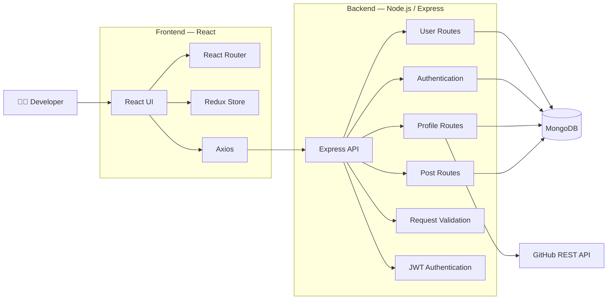
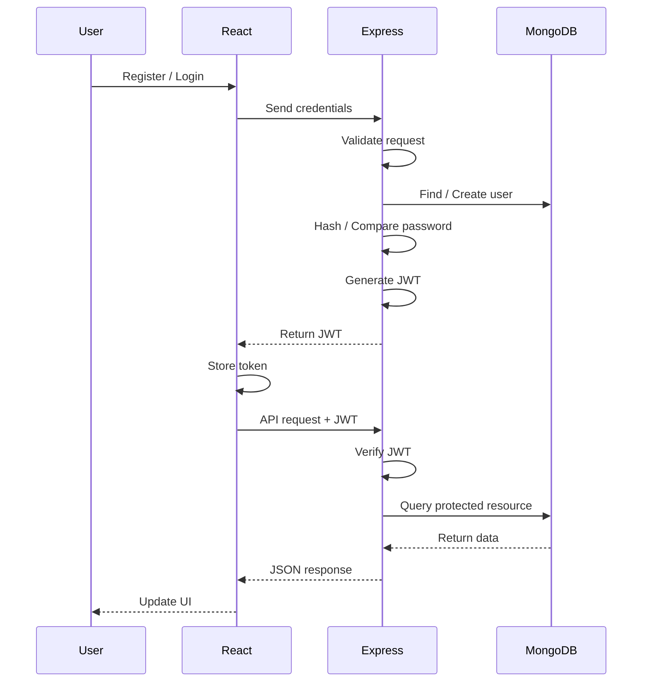

# 🚀 DevConnector

<p align="center">
  <strong>A full-stack social network for developers to create profiles, connect with other developers, and share knowledge.</strong>
</p>

<p align="center">
  <a href="https://github.com/Shrejall/devConnector">
    
  </a>
  <a href="https://github.com/Shrejall/devConnector/network/members">
    
  </a>
  <a href="https://github.com/Shrejall/devConnector/issues">
    
  </a>
  
  
  
</p>

---

## 🌐 Live Demo

🔗 **Live Demo:** https://devconnector-yjzo.onrender.com

🔗 **GitHub Repository:** [Shrejall/devConnector](https://github.com/Shrejall/devConnector)

DevConnector is a MERN-stack developer community platform where users can create professional profiles, discover other developers, share posts, interact through likes and comments, and showcase their GitHub repositories.

---

## 📸 Screenshots

### 🏠 Landing Page

<p align="center">
 

</p>

### 👨‍💻 Developer Profiles

<p align="center">
  
</p>

### 👤 Developer Profile

<p align="center">
  

</p>

### 💬 Community Posts

<p align="center">
  

</p>

### 📊 Dashboard

<p align="center">

</p>

### 🔐 Authentication

<p align="center">
 

</p>

---

## ✨ Features

### 👤 Developer Profiles

* Create and manage a professional developer profile
* Add current professional status
* Add skills
* Add company, website, location, and bio
* Add professional experience
* Add educational background
* Add social media profiles
* Browse profiles of other developers
* View individual developer profiles
* Display GitHub repositories using a GitHub username

### 🔐 Authentication & Security

* User registration and login
* Password validation
* Password hashing using **bcryptjs**
* JWT-based authentication
* Protected frontend routes
* Protected API endpoints
* Persistent authentication using local storage
* Request validation using **express-validator**
* Gravatar profile avatars
* Authorization checks for user-owned resources

### 💬 Developer Community

* Create developer posts
* View community posts
* View individual posts
* Like and unlike posts
* Add comments to posts
* Delete your own posts
* Delete your own comments

### ⚛️ Frontend

* React single-page application
* React Router navigation
* Redux state management
* Redux Thunk for asynchronous actions
* Axios for API communication
* Reusable React components
* Protected routes
* Loading states
* Alert notifications
* Responsive interface

### 🔗 GitHub Integration

Developers can add their GitHub username to their profile and retrieve their public repositories through the **GitHub REST API**.

---

## 🧰 Tech Stack

| Category              | Technologies                            |
| --------------------- | --------------------------------------- |
| **Frontend**          | React, React Router, Redux, Redux Thunk |
| **Backend**           | Node.js, Express.js                     |
| **Database**          | MongoDB, Mongoose                       |
| **Authentication**    | JSON Web Token, bcryptjs                |
| **API Communication** | Axios                                   |
| **Validation**        | express-validator                       |
| **Avatar**            | Gravatar                                |
| **External API**      | GitHub REST API                         |
| **Date Handling**     | Moment.js                               |
| **Development**       | Nodemon, Concurrently                   |

---

## 🏗️ Architecture



---

## 🔄 Application Flow

```text
                    ┌─────────────────┐
                    │    Developer    │
                    └────────┬────────┘
                             │
                             ▼
                    ┌─────────────────┐
                    │  React Client   │
                    └────────┬────────┘
                             │
                          Axios
                             │
                             ▼
                    ┌─────────────────┐
                    │   Express API   │
                    └────────┬────────┘
                             │
              ┌──────────────┼──────────────┐
              ▼              ▼              ▼
        ┌──────────┐   ┌──────────┐   ┌──────────┐
        │   Auth   │   │ Profile  │   │  Posts   │
        └────┬─────┘   └────┬─────┘   └────┬─────┘
             │              │              │
             └──────────────┼──────────────┘
                            ▼
                     ┌─────────────┐
                     │   MongoDB   │
                     └─────────────┘
                            │
                            ▼
                     ┌─────────────┐
                     │ GitHub API  │
                     └─────────────┘
```

---

## 🔐 Authentication Flow



---

## 📁 Project Structure

```text
devConnector/
│
├── client/
│   ├── public/
│   │
│   └── src/
│       ├── actions/
│       │   └── Redux actions
│       │
│       ├── components/
│       │   ├── auth/
│       │   │   ├── Login
│       │   │   └── Register
│       │   │
│       │   ├── dashboard/
│       │   │   └── Dashboard
│       │   │
│       │   ├── layout/
│       │   │   ├── Navbar
│       │   │   ├── Landing
│       │   │   ├── Alert
│       │   │   └── Spinner
│       │   │
│       │   ├── post/
│       │   │   └── Post
│       │   │
│       │   ├── posts/
│       │   │   └── Posts
│       │   │
│       │   ├── profile/
│       │   │   └── Profile
│       │   │
│       │   ├── profile-forms/
│       │   │   ├── CreateProfile
│       │   │   ├── EditProfile
│       │   │   ├── AddExperience
│       │   │   └── AddEducation
│       │   │
│       │   ├── profiles/
│       │   │   └── Profiles
│       │   │
│       │   └── routing/
│       │       └── PrivateRoute
│       │
│       ├── reducers/
│       ├── utils/
│       ├── img/
│       ├── App.js
│       ├── store.js
│       └── index.js
│
├── config/
│   └── db.js
│
├── middleware/
│   └── auth.js
│
├── models/
│   ├── User.js
│   ├── Profile.js
│   └── Post.js
│
├── routes/
│   └── api/
│       ├── users.js
│       ├── auth.js
│       ├── profile.js
│       └── posts.js
│
├── server.js
├── package.json
├── package-lock.json
└── README.md
```

---

## 🚀 Getting Started

### Prerequisites

Make sure you have the following installed:

* [Node.js](https://nodejs.org/)
* npm
* MongoDB
* Git

### 1. Clone the Repository

```bash
git clone https://github.com/Shrejall/devConnector.git
cd devConnector
```

### 2. Install Backend Dependencies

```bash
npm install
```

### 3. Install Frontend Dependencies

```bash
cd client
npm install
cd ..
```

### 4. Configure MongoDB & JWT

The backend uses the `config` package for application configuration.

Create the required configuration values:

```text
mongoURI
jwtSecret
```

Example:

```json
{
  "mongoURI": "your_mongodb_connection_string",
  "jwtSecret": "your_jwt_secret"
}
```

> ⚠️ Never commit database credentials, JWT secrets, API keys, or other sensitive configuration to GitHub.

### 5. Run the Application

Run both frontend and backend together:

```bash
npm run dev
```

Or run them separately.

**Backend:**

```bash
npm run server
```

**Frontend:**

```bash
npm run client
```

The React development server communicates with the Express backend through the configured proxy.

---

## 📚 API Overview

### Authentication & Users

| Method | Endpoint     | Description            | Auth |
| ------ | ------------ | ---------------------- | :--: |
| `POST` | `/api/users` | Register a user        |   ❌  |
| `POST` | `/api/auth`  | Login and receive JWT  |   ❌  |
| `GET`  | `/api/auth`  | Get authenticated user |   ✅  |

### Profiles

| Method   | Endpoint                          | Description                | Auth |
| -------- | --------------------------------- | -------------------------- | :--: |
| `GET`    | `/api/profile`                    | Get all developer profiles |   ❌  |
| `GET`    | `/api/profile/me`                 | Get current user's profile |   ✅  |
| `POST`   | `/api/profile`                    | Create / update profile    |   ✅  |
| `GET`    | `/api/profile/user/:user_id`      | Get profile by user ID     |   ❌  |
| `DELETE` | `/api/profile`                    | Delete profile and user    |   ✅  |
| `PUT`    | `/api/profile/experience`         | Add experience             |   ✅  |
| `DELETE` | `/api/profile/experience/:exp_id` | Delete experience          |   ✅  |
| `PUT`    | `/api/profile/education`          | Add education              |   ✅  |
| `DELETE` | `/api/profile/education/:edu_id`  | Delete education           |   ✅  |
| `GET`    | `/api/profile/github/:username`   | Get GitHub repositories    |   ❌  |

### Posts

| Method   | Endpoint                             | Description      | Auth |
| -------- | ------------------------------------ | ---------------- | :--: |
| `POST`   | `/api/posts`                         | Create a post    |   ✅  |
| `GET`    | `/api/posts`                         | Get all posts    |   ✅  |
| `GET`    | `/api/posts/:id`                     | Get post by ID   |   ✅  |
| `DELETE` | `/api/posts/:id`                     | Delete own post  |   ✅  |
| `PUT`    | `/api/posts/like/:id`                | Like a post      |   ✅  |
| `PUT`    | `/api/posts/unlike/:id`              | Unlike a post    |   ✅  |
| `POST`   | `/api/posts/comment/:id`             | Add a comment    |   ✅  |
| `DELETE` | `/api/posts/comment/:id/:comment_id` | Delete a comment |   ✅  |

---

## 🧪 Available Scripts

### Run Backend

```bash
npm run server
```

### Run Frontend

```bash
npm run client
```

### Run Full Stack

```bash
npm run dev
```

### Create Production Build

```bash
npm run build
```

---

## 📦 Production Deployment

For production, the React application is built using:

```bash
npm run build
```

The Express server is configured to serve the generated React application from:

```text
client/build
```

This allows the application to be deployed as a full-stack application with Express serving the React frontend in production.

---

## 🛡️ Security

DevConnector implements several security practices:

* Password hashing using `bcryptjs`
* JWT authentication
* Protected API routes
* Protected frontend routes
* Input validation
* User authorization checks
* Sensitive configuration kept outside source code

Authentication middleware verifies JWT tokens before allowing access to protected resources.

---

## 🤝 Contributing

Contributions, suggestions, and improvements are welcome.

### Fork the repository

```bash
git clone https://github.com/Shrejall/devConnector.git
```

### Create a feature branch

```bash
git checkout -b feature/your-feature
```

### Commit your changes

```bash
git commit -m "feat: add your feature"
```

### Push the branch

```bash
git push origin feature/your-feature
```

Then open a Pull Request.

---

## 📄 License

This project is licensed under the **ISC License**.

---

## 👨‍💻 Author

### Shrejal

Full-stack developer building web applications with modern JavaScript technologies.

<p>
  <a href="https://github.com/Shrejall">
    
  </a>
</p>

---
